# FAstest eMOji Search (FAMOS)
An [Alfred](https://alfredapp.com) workflow for emojis that supports
keyword-based search in [multiple languages](#famos-speaks-many-languages) and
[creating stickers](#cook-fresh-emojis-with-emoji-kitchen) with Google's
[Emoji Kitchen][4].

### FAMOS speaks many languages!

FAMOS uses [emojibase][3], which is an excellent library, meticulously
curated. So, all the languages that [emojibase][3] supports, FAMOS automatically
does too.

### FAMOS is the fastest!
**10x** to **20x** faster compared to [alfred-emoji][1] and [EmojiTaco][2]!

FAMOS launches in under 20 miliseconds (imperceptible), while both
the other workflows take hundreds of milliseconds to launch (very
much perceptible).

The reason FAMOS exists is that I wanted my emoji picker to:
 - launch instantly
 - search with zero lag
 - let me pick skin-tones for each individual emoji

### Cook fresh emojis with Emoji Kitchen!
Google's [Emoji Kitchen][4] lets us combine two emojis:
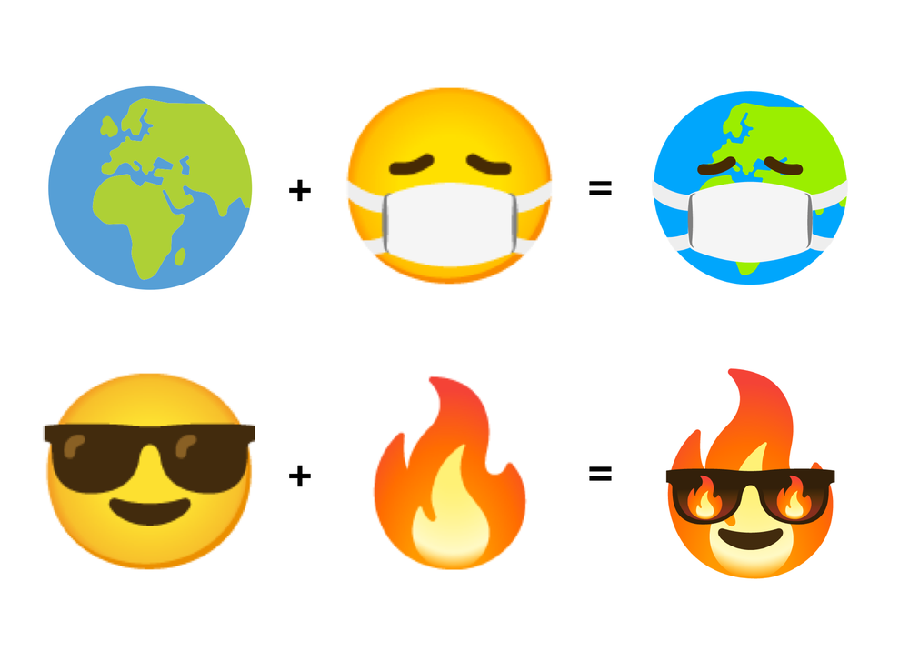

For many emojis, the Emoji Kitchen already has pre-cooked menu.
Here's how to access that in FAMOS:
1. Search for the emoji:
   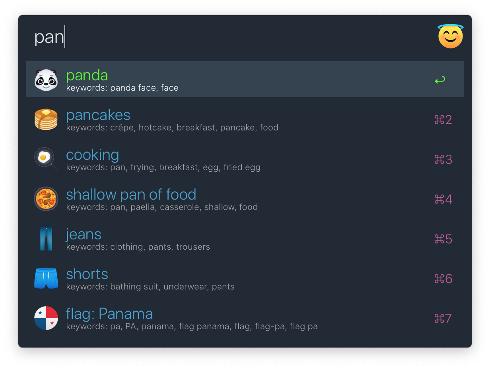
2. Hold `option`:
   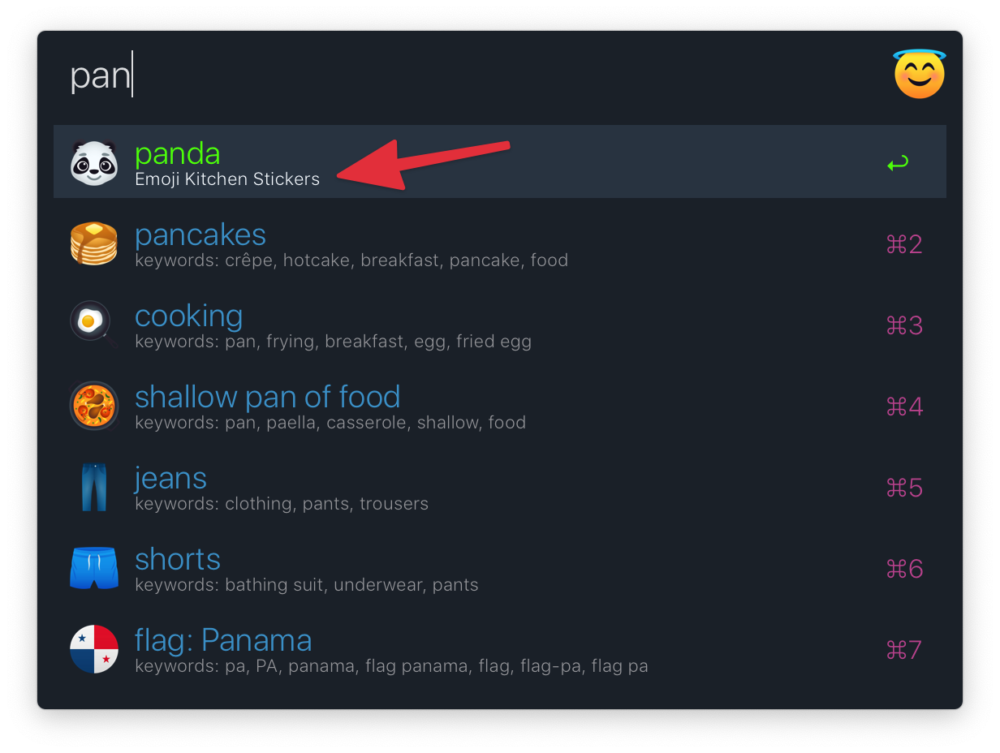
3. Pressing enter shows the pre-cooked menu:
   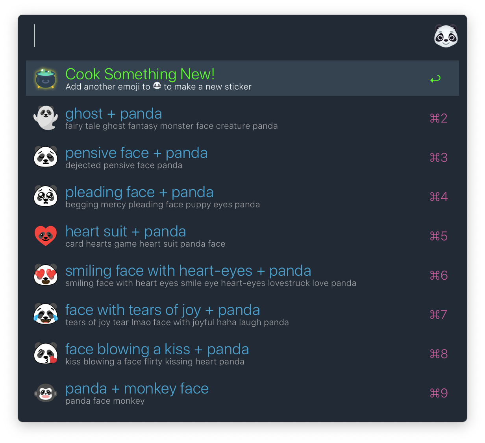

Wait, isn't the cutest panda a hugging panda?
When you don't find the combo you want in the pre-cooked menu,
it is time to cook something new!
1. Select `Cook Something New!` and press enter. A list of all emojis is shown:
   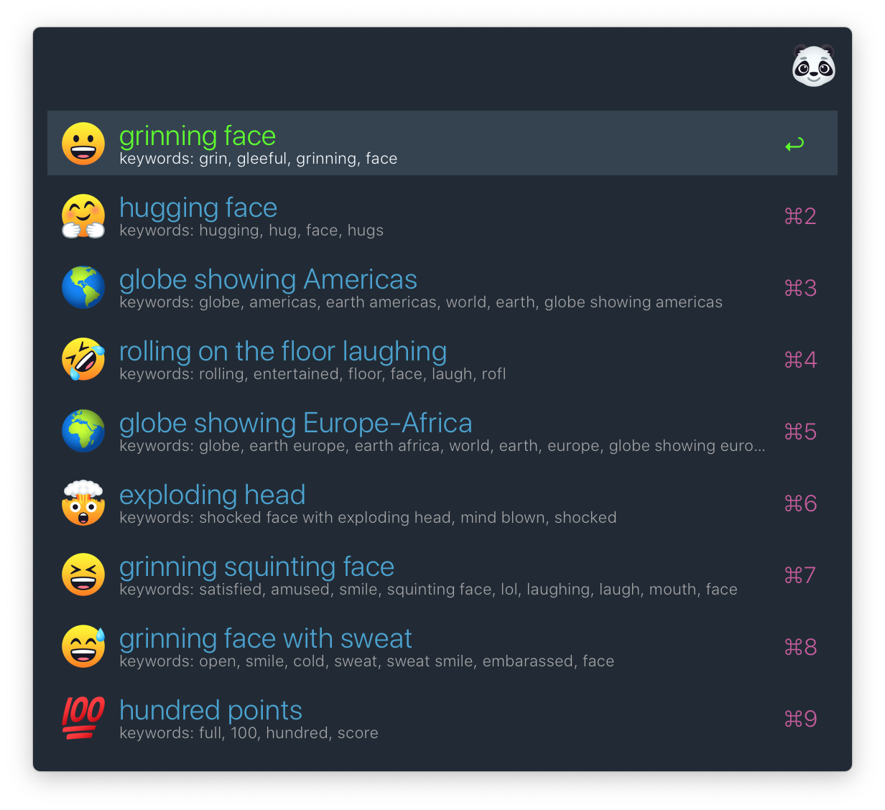
2. Type and select the desired emoji and press enter:
   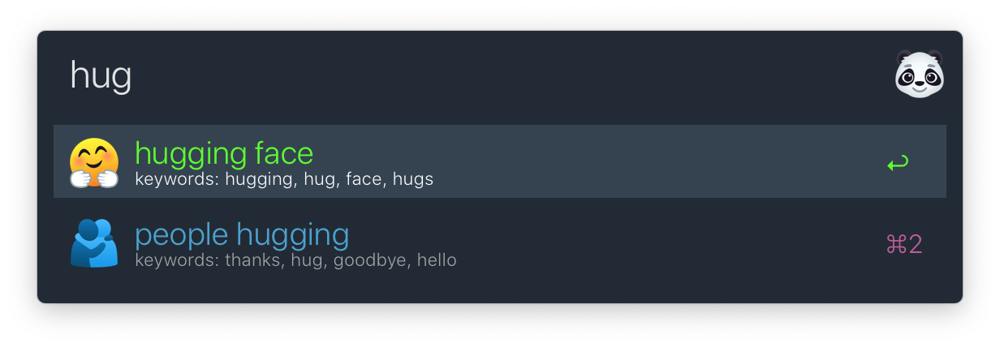
3. Yayy! The hugging panda is ready!
   

You can search through all the previously-accessed pre-cooked menus
and new stickers that you cooked yourself from the "Emoji Fridge" by
typing `emofridge`:
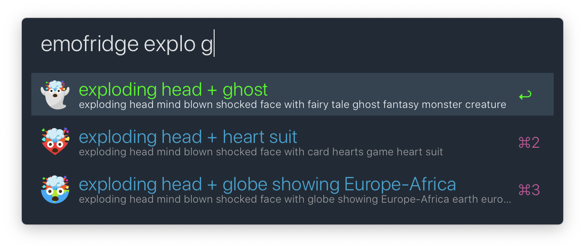

### Skin-tone prefs for each individual emoji
I like my emojis to reflect my skin-tone correctly. **And also hair color!**
That means, I might not always get both. So, I want hand-emojis to
have my skin-tone, but all face-emojis to have my hair-color
(and wrong skin-tone). In addition, if you're a stickler like me,
you will understand that I want one skin-tone for the palm and
a different one for the back of the hand. Back of the hand is a shade darker
than the palm, isn't it!

1. Search results show if an emoji has multiple tones available:
   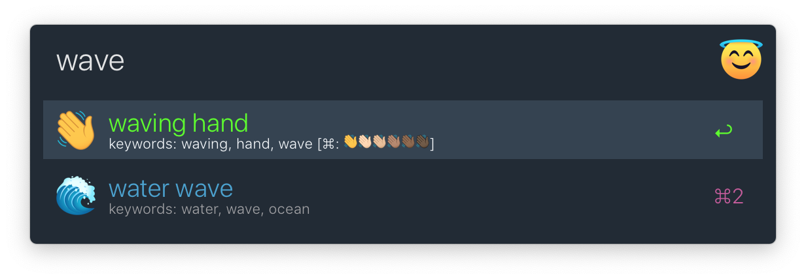
2. Hold command:
   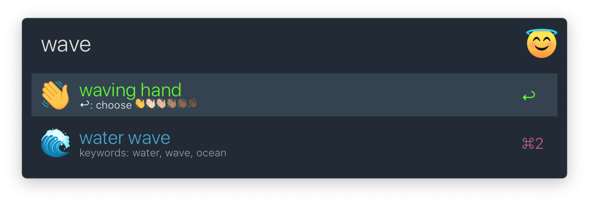
3. After pressing command+enter:
   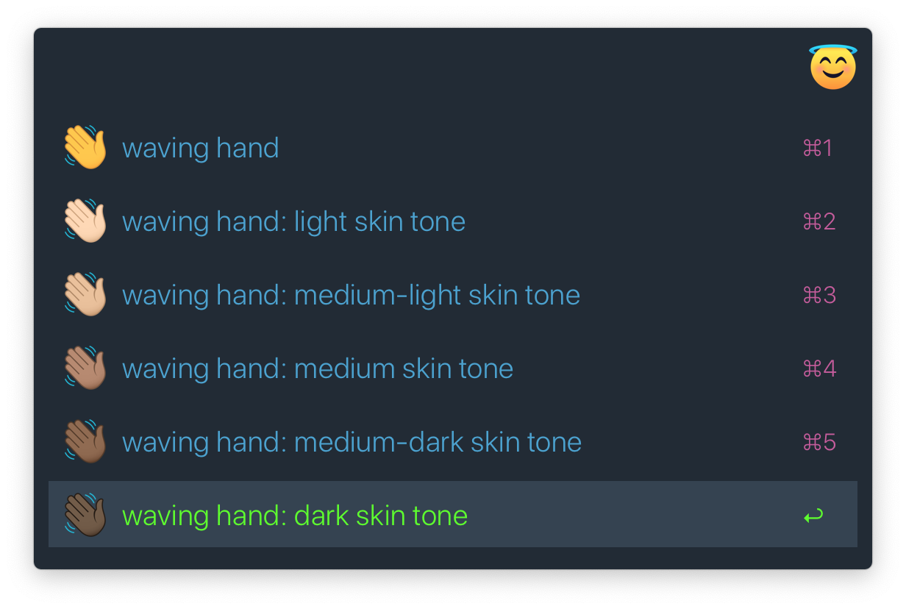
4. From now on, the chosen tone becomes the default tone for this emoji:
   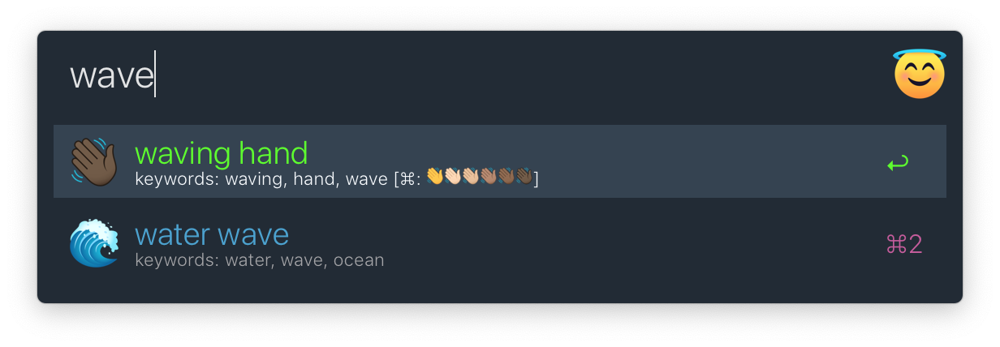

### Feature comparison
Both [alfred-emoji][1] and [EmojiTaco][2] are excellent workflows, and they
have tonnes of features that FAMOS doesn't have presently, and has no plans
of implementing. You should definitely check them out!

#### Latest and Greatest
|            | FAMOS         | [alfred-emoji][1]  |   [EmojiTaco][2]   |
|-----------:|:-------------:|:------------------:|:------------------:|
| workflow-auto-update | :x: | :white_check_mark: | :white_check_mark: |
| emoji-auto-update                   | :x: | :x: | :white_check_mark: |
| warns for unsupported emoji         | :x: | :x: | :white_check_mark: |
| simply don't show unsupported emoji | :x: | :white_check_mark: | :x: |

#### Ease of Use
|            | FAMOS         | [alfred-emoji][1]  |   [EmojiTaco][2]   |
|-----------:|:-------------:|:------------------:|:------------------:|
| remember frequently used emoji   | :white_check_mark: | :white_check_mark: | :x: |
| keyword-based search             | :white_check_mark: | :white_check_mark: | :x: |
| show keywords used for searching | :white_check_mark: | :x:                | :x: |
| instant launch, instant search   | :white_check_mark: | :x:                | :x: |

#### Skin-tones
|            | FAMOS         | [alfred-emoji][1]  |   [EmojiTaco][2]   |
|-----------:|:-------------:|:------------------:|:------------------:|
| global skin-tone preference                     | :x: | :white_check_mark: | :x: |
| all skin-tones always accessible | :white_check_mark: | :x: | :white_check_mark: |
| setting default skin-tone for individual emoji  | :white_check_mark: | :x: | :x: |

#### Other Goodies
|            | FAMOS        | [alfred-emoji][1]  |   [EmojiTaco][2]   |
|-----------:|:------------:|:------------------:|:------------------:|
| non-english languages              | :white_check_mark: | :x: | :x: |
| Google Emoji Kitchen               | :white_check_mark: | :x: | :x: |
| copy python string                 | :x: | :x: | :white_check_mark: |
| copy decoded python string         | :x: | :x: | :white_check_mark: |
| copy unicode value                 | :x: | :x: | :white_check_mark: |
| copy slack/github code             | :x: | :white_check_mark: | :x: |
| copy without skintone              | :x: | :white_check_mark: | :x: |
| default copy with autopaste option | :x: | :white_check_mark: | :x: |
| emoji icons              | apple, joypixels | any installed | apple |

### Downloads
|Language|||
|:----------:|:------------:|:------------------:|
|Chinese, Traditional| [apple](https://github.com/mr-pennyworth/alfred-fastest-emoji/releases/latest/download/Fastest.Emoji.Search-zh-hant-apple.alfredworkflow) | [joypixels](https://github.com/mr-pennyworth/alfred-fastest-emoji/releases/latest/download/Fastest.Emoji.Search-zh-hant-joypixels.alfredworkflow)|
|Chinese| [apple](https://github.com/mr-pennyworth/alfred-fastest-emoji/releases/latest/download/Fastest.Emoji.Search-zh-apple.alfredworkflow) | [joypixels](https://github.com/mr-pennyworth/alfred-fastest-emoji/releases/latest/download/Fastest.Emoji.Search-zh-joypixels.alfredworkflow)|
|Danish| [apple](https://github.com/mr-pennyworth/alfred-fastest-emoji/releases/latest/download/Fastest.Emoji.Search-da-apple.alfredworkflow) | [joypixels](https://github.com/mr-pennyworth/alfred-fastest-emoji/releases/latest/download/Fastest.Emoji.Search-da-joypixels.alfredworkflow)|
|Dutch| [apple](https://github.com/mr-pennyworth/alfred-fastest-emoji/releases/latest/download/Fastest.Emoji.Search-nl-apple.alfredworkflow) | [joypixels](https://github.com/mr-pennyworth/alfred-fastest-emoji/releases/latest/download/Fastest.Emoji.Search-nl-joypixels.alfredworkflow)|
|English, Great Britain| [apple](https://github.com/mr-pennyworth/alfred-fastest-emoji/releases/latest/download/Fastest.Emoji.Search-en-gb-apple.alfredworkflow) | [joypixels](https://github.com/mr-pennyworth/alfred-fastest-emoji/releases/latest/download/Fastest.Emoji.Search-en-gb-joypixels.alfredworkflow)|
|English| [apple](https://github.com/mr-pennyworth/alfred-fastest-emoji/releases/latest/download/Fastest.Emoji.Search-en-apple.alfredworkflow) | [joypixels](https://github.com/mr-pennyworth/alfred-fastest-emoji/releases/latest/download/Fastest.Emoji.Search-en-joypixels.alfredworkflow)|
|Estonian| [apple](https://github.com/mr-pennyworth/alfred-fastest-emoji/releases/latest/download/Fastest.Emoji.Search-et-apple.alfredworkflow) | [joypixels](https://github.com/mr-pennyworth/alfred-fastest-emoji/releases/latest/download/Fastest.Emoji.Search-et-joypixels.alfredworkflow)|
|Finnish| [apple](https://github.com/mr-pennyworth/alfred-fastest-emoji/releases/latest/download/Fastest.Emoji.Search-fi-apple.alfredworkflow) | [joypixels](https://github.com/mr-pennyworth/alfred-fastest-emoji/releases/latest/download/Fastest.Emoji.Search-fi-joypixels.alfredworkflow)|
|French| [apple](https://github.com/mr-pennyworth/alfred-fastest-emoji/releases/latest/download/Fastest.Emoji.Search-fr-apple.alfredworkflow) | [joypixels](https://github.com/mr-pennyworth/alfred-fastest-emoji/releases/latest/download/Fastest.Emoji.Search-fr-joypixels.alfredworkflow)|
|German| [apple](https://github.com/mr-pennyworth/alfred-fastest-emoji/releases/latest/download/Fastest.Emoji.Search-de-apple.alfredworkflow) | [joypixels](https://github.com/mr-pennyworth/alfred-fastest-emoji/releases/latest/download/Fastest.Emoji.Search-de-joypixels.alfredworkflow)|
|Hungarian| [apple](https://github.com/mr-pennyworth/alfred-fastest-emoji/releases/latest/download/Fastest.Emoji.Search-hu-apple.alfredworkflow) | [joypixels](https://github.com/mr-pennyworth/alfred-fastest-emoji/releases/latest/download/Fastest.Emoji.Search-hu-joypixels.alfredworkflow)|
|Italian| [apple](https://github.com/mr-pennyworth/alfred-fastest-emoji/releases/latest/download/Fastest.Emoji.Search-it-apple.alfredworkflow) | [joypixels](https://github.com/mr-pennyworth/alfred-fastest-emoji/releases/latest/download/Fastest.Emoji.Search-it-joypixels.alfredworkflow)|
|Japanese| [apple](https://github.com/mr-pennyworth/alfred-fastest-emoji/releases/latest/download/Fastest.Emoji.Search-ja-apple.alfredworkflow) | [joypixels](https://github.com/mr-pennyworth/alfred-fastest-emoji/releases/latest/download/Fastest.Emoji.Search-ja-joypixels.alfredworkflow)|
|Korean| [apple](https://github.com/mr-pennyworth/alfred-fastest-emoji/releases/latest/download/Fastest.Emoji.Search-ko-apple.alfredworkflow) | [joypixels](https://github.com/mr-pennyworth/alfred-fastest-emoji/releases/latest/download/Fastest.Emoji.Search-ko-joypixels.alfredworkflow)|
|Lithuanian| [apple](https://github.com/mr-pennyworth/alfred-fastest-emoji/releases/latest/download/Fastest.Emoji.Search-lt-apple.alfredworkflow) | [joypixels](https://github.com/mr-pennyworth/alfred-fastest-emoji/releases/latest/download/Fastest.Emoji.Search-lt-joypixels.alfredworkflow)|
|Malay| [apple](https://github.com/mr-pennyworth/alfred-fastest-emoji/releases/latest/download/Fastest.Emoji.Search-ms-apple.alfredworkflow) | [joypixels](https://github.com/mr-pennyworth/alfred-fastest-emoji/releases/latest/download/Fastest.Emoji.Search-ms-joypixels.alfredworkflow)|
|Norwegian| [apple](https://github.com/mr-pennyworth/alfred-fastest-emoji/releases/latest/download/Fastest.Emoji.Search-nb-apple.alfredworkflow) | [joypixels](https://github.com/mr-pennyworth/alfred-fastest-emoji/releases/latest/download/Fastest.Emoji.Search-nb-joypixels.alfredworkflow)|
|Polish| [apple](https://github.com/mr-pennyworth/alfred-fastest-emoji/releases/latest/download/Fastest.Emoji.Search-pl-apple.alfredworkflow) | [joypixels](https://github.com/mr-pennyworth/alfred-fastest-emoji/releases/latest/download/Fastest.Emoji.Search-pl-joypixels.alfredworkflow)|
|Portuguese| [apple](https://github.com/mr-pennyworth/alfred-fastest-emoji/releases/latest/download/Fastest.Emoji.Search-pt-apple.alfredworkflow) | [joypixels](https://github.com/mr-pennyworth/alfred-fastest-emoji/releases/latest/download/Fastest.Emoji.Search-pt-joypixels.alfredworkflow)|
|Russian| [apple](https://github.com/mr-pennyworth/alfred-fastest-emoji/releases/latest/download/Fastest.Emoji.Search-ru-apple.alfredworkflow) | [joypixels](https://github.com/mr-pennyworth/alfred-fastest-emoji/releases/latest/download/Fastest.Emoji.Search-ru-joypixels.alfredworkflow)|
|Spanish, Mexico| [apple](https://github.com/mr-pennyworth/alfred-fastest-emoji/releases/latest/download/Fastest.Emoji.Search-es-mx-apple.alfredworkflow) | [joypixels](https://github.com/mr-pennyworth/alfred-fastest-emoji/releases/latest/download/Fastest.Emoji.Search-es-mx-joypixels.alfredworkflow)|
|Spanish| [apple](https://github.com/mr-pennyworth/alfred-fastest-emoji/releases/latest/download/Fastest.Emoji.Search-es-apple.alfredworkflow) | [joypixels](https://github.com/mr-pennyworth/alfred-fastest-emoji/releases/latest/download/Fastest.Emoji.Search-es-joypixels.alfredworkflow)|
|Swedish| [apple](https://github.com/mr-pennyworth/alfred-fastest-emoji/releases/latest/download/Fastest.Emoji.Search-sv-apple.alfredworkflow) | [joypixels](https://github.com/mr-pennyworth/alfred-fastest-emoji/releases/latest/download/Fastest.Emoji.Search-sv-joypixels.alfredworkflow)|
|Thai| [apple](https://github.com/mr-pennyworth/alfred-fastest-emoji/releases/latest/download/Fastest.Emoji.Search-th-apple.alfredworkflow) | [joypixels](https://github.com/mr-pennyworth/alfred-fastest-emoji/releases/latest/download/Fastest.Emoji.Search-th-joypixels.alfredworkflow)|
|Ukrainian| [apple](https://github.com/mr-pennyworth/alfred-fastest-emoji/releases/latest/download/Fastest.Emoji.Search-uk-apple.alfredworkflow) | [joypixels](https://github.com/mr-pennyworth/alfred-fastest-emoji/releases/latest/download/Fastest.Emoji.Search-uk-joypixels.alfredworkflow)|

### Icon Credits
Icons made by editing icon created by
[Smashicons](https://www.flaticon.com/authors/smashicons)
from [flaticon](https://www.flaticon.com)

[1]: https://github.com/jsumners/alfred-emoji
[2]: https://github.com/jeeftor/EmojiTaco
[3]: https://github.com/milesj/emojibase
[4]: https://blog.google/products/android/emoji-kitchen-new-mashups-mixing-experience/